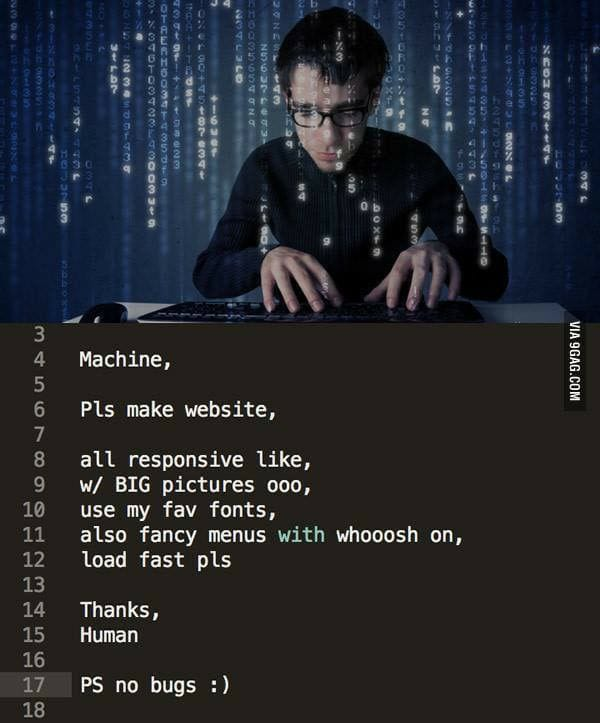

# please-make-website
Pls make website, all responsive like, etc...

Based on the meme:



---

## ChatGPT Prompts

First prompt:
```
Can you make a website? A responsive one, with big pictures,
using my favorite fonts like Roboto, with fancy interactive
menus and loading faster even on limited / low-end devices?
```

Second prompt:
```
Show me an example of this website in a single page, with
CSS and JS included in this single HTML page / file.
```

Third prompt:

```
For the background image, assume this URL
https://www.marcoonroad.dev/please-make-website/background-open-office.jpg
instead of the URL https://via.placeholder.com/1200x800. Also,
improve the layout of menu buttons, the hover effect over
them seems very awkward, can you make them more clean?
```

4th Prompt:

```
Adicione um modal de chatbot ali pelo fundo-direita da página,
esse modal flutua independente do scroll que o usuário realiza na
página. Utilize essa imagem 1024x1024 na URL
https://www.marcoonroad.dev/please-make-website/sac-robot.jpeg e
ajuste o tamanho dela para 30x30 para a caixa de chatbot, essa
caixa de texto se expande quando o usuário clica nele. Por hora
as conversas enviadas / recebidas não estão integradas, então
apenas um mock em JavaScript será utilizado, pois futuramente
existirá uma rota de integração nisso.
```

5th Prompt:

```
O ícone do chatbot 20x20 está estranho, faça um filtro de corte
circular sobre a imagem em CSS, além de aumentar o tamanho
para 35x35.
```

6th Prompt:

```
Me mostre apenas o código JavaScript da página, que está dentro
da tag script, porém, adicione o efeito / caso do modal de
chatbot aberto, ao clicar no ícone do robô, esse modal contrai
denovo para mostrar apenas o ícone do robô.
```

7th Prompt:

```
O código para contrair o chatbot expandido ao clicar no robô
não funciona, poderia explicar o por que?
```

8th Prompt:

```
O código não funciona porque o elemento #chatbot-toggle, ao
ser clicado para expandir a caixa de chatbot, some / é oculto,
portanto adicione no elemento #chatbot-header um handler, que
ao ser clicado, oculta toda caixa de chatbot sob elemento
#chatbot e mostra novamente o elemento do ícone #chatbot-toggle.
```

## Adobe Firefly Prompts

```
Gere uma imagem 1200x800 de um ambiente corporativo, mais
especificamente um escritório open-office de tecnologia bem
descontraído.
```

## Microsoft Designer

```
Crie um ícone simples e circular de um robô amigável pronto
para atender dúvidas e sugestões, pois ele está com um fone
de SAC.
```
